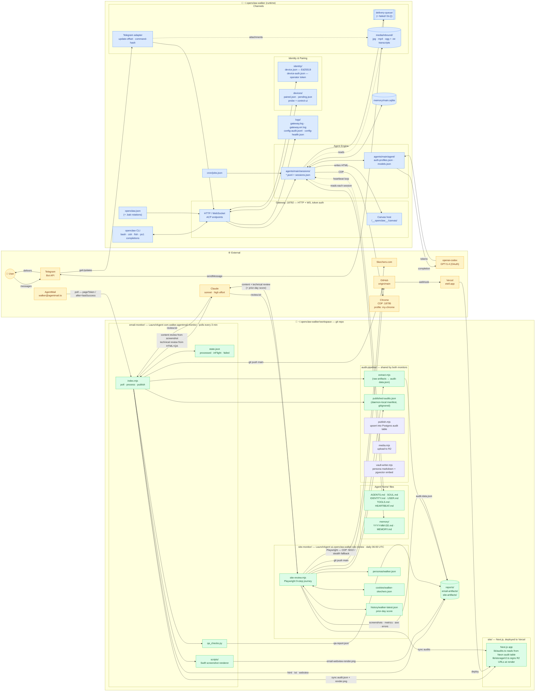

# openclaw-walker — Architecture

A single-glance map of **this setup**: the openclaw-walker runtime at
`~/.openclaw-walker/`, the workspace subprojects that live inside it, and every
external service they touch.

## Quick start for a new Claude session

Working directory is always `~/.openclaw-walker/workspace/`. The repo deploys to
**https://etell.app** (prod; also reachable at `https://email-audit-weld.vercel.app`),
gated by Auth.js v5 magic-link — allowlist-only, no self-signup.

**The live site is the Next.js app in `site/`.** Anything that should appear on
the live site must change `site/`. Common pitfall: there is no static site
generator anymore — the only build system is `next build`, run by Vercel after
each push to `main`.

**The audit pipeline writes to `site/`, doesn't live in it.** Two LaunchAgent
daemons produce the content:

| Producer | Lives in | Triggers | What it makes |
|---|---|---|---|
| `email-monitor` | `email-monitor/` | every 3 min poll | reviews of marketing emails from `walker@agentmail.to` |
| `site-monitor` | `site-monitor/` | daily 06:00 UTC | Playwright site-journey reviews on Skechers.com |

Both share `audit-pipeline/`:

- `audit-pipeline/extract.mjs` — converts raw artifacts → `audit-data.json` (used only by email-monitor; site-monitor builds its own in JS). Ported from Python in foundation P5.
- `audit-pipeline/publish.mjs` — shared DB writer (`upsertAuditRow`) + media-key helpers.
- `audit-pipeline/media.mjs` — R2 upload with retry.
- `audit-pipeline/vault-writer.mjs` — writes per-persona vault markdown + embedding.
- `audit-pipeline/published-audits.json` — daemon-local manifest (gitignored).

After producing `audit-data.json`, the daemons upload media to R2, upsert the
audit into Postgres (`audit` table), write a vault markdown note, and
`git push vaults/` to main. The live site reads audits from Postgres on
request — Vercel does NOT redeploy on each new audit.

**To change daemon code, you must restart its LaunchAgent** — both daemons run
in-memory until restarted. See `email-monitor/CLAUDE.md` and
`site-monitor/CLAUDE.md` for restart commands and per-daemon details.

**The `site/` Next.js app is also unusual** — see `site/AGENTS.md` (Next.js 16 with
Turbopack and breaking changes from training-data conventions).

**End-to-end pipeline test:** `cd email-monitor && node verify-pipeline.mjs` —
sends a mock email through the full flow, verifies it appears on the live site,
then cleans up. Takes ~80 seconds when healthy.

## Diagram

## Legend

| Color | Zone | What lives here |
|---|---|---|
| 🟡 Amber | **External** | Services and actors outside this machine (or outside the openclaw process tree) |
| 🔵 Blue | **Runtime** | Everything under `~/.openclaw-walker/` that the openclaw process manages |
| 🟢 Green | **Workspace** | Everything under `~/.openclaw-walker/workspace/` — the agent's gitted "home" and its subprojects |

Shape conventions:

- `(( circle ))` — human actor
- `[ box ]` — process, adapter, or config file
- `([ cylinder ])` — datastore (sqlite, file collections)
- `[[ queue ]]` — queue with a DLQ

Line conventions:

- Solid arrow — primary request/response flow
- Dotted arrow — out-of-band read or loose coupling

## Notable facts (not obvious from the diagram)

- **Gateway is local-only.** Binds to `127.0.0.1:18792`, token auth from
  `openclaw.json` (`gateway.auth.token`). Remote URL is the same loopback —
  there is no public endpoint.
- **Two paired devices** in `devices/paired.json`:
  - `openclaw-probe` (clientMode `probe`) — full operator scopes:
    `admin · read · write · approvals · pairing`.
  - `openclaw-control-ui` (clientMode `webchat`) — scoped down to
    `admin · approvals · pairing` only.
- **Telegram channel policy**: DM `open`, group `allowlist`, `allowFrom: "*"`.
  Streaming mode `partial`. Bot token lives in `openclaw.json` under
  `channels.telegram.botToken`.
- **Two different LLMs in one setup** — this is the thing that catches you off
  guard:
  - The **walker agent** (the thing you chat with on Telegram) runs on
    `openai-codex/gpt-5.4` via OAuth.
  - The **monitor daemons** (`email-monitor`, `site-monitor`) call **Claude
    sonnet** at `high` effort for their reviews. They don't go through the
    gateway or the agent engine at all.
- **Monitor daemons are independent of the gateway.** Both run as user
  LaunchAgents (`~/Library/LaunchAgents/com.walker.agentmail-monitor.plist`,
  `~/Library/LaunchAgents/ai.openclaw.walker.site-review.plist`). If you stop
  the openclaw gateway, they keep running. They share data with the gateway
  only via the filesystem (`workspace/reports/`, `workspace/audit-pipeline/`,
  `workspace/site/content/`).
- **`cron/jobs.json` is currently empty** (`{"version":1,"jobs":[]}`). Periodic
  behavior today is: LaunchAgents for the two monitor daemons, plus the
  heartbeat loop described in `workspace/AGENTS.md` / `workspace/HEARTBEAT.md`
  for conversational check-ins.
- **Canvas host** serves any HTML the agent drops into
  `~/.openclaw-walker/canvas/` at
  `http://127.0.0.1:18792/__openclaw__/canvas/`.
- **Browser skill** uses an existing Chrome session at
  `http://127.0.0.1:18795` (profile `my-chrome`) — that's a real Chrome with
  user cookies, not a headless one.
- **Media attachments** from Telegram land in `media/inbound/`. Voice notes
  already have a `.ogg.txt` transcript written alongside the audio by whatever
  transcription step runs in the ingest path.
- **Email-monitor publishing is Postgres-driven.** Each processed email upserts
  into the Neon `audit` table, uploads media to R2, and writes a vault
  markdown note. Only the vault commit goes to git; Vercel does NOT
  redeploy on each new audit (the site reads from the DB on request).
- **Site-monitor is idempotent per day.** It checks
  `audit-pipeline/published-audits.json` (daemon-local) for today's slug before
  running; won't double-publish if relaunched.
- **The site is gated** server-side by Auth.js v5 magic-link in `site/auth.ts`;
  `site/proxy.ts` enforces the session on every request. Allowlist-only (no
  self-signup).

## Source files this was derived from

If any of this gets stale, these are the files to re-read when refreshing the
diagram:

- Runtime config / identity:
  - `openclaw.json` (+ `.bak` rotations)
  - `identity/device.json`, `identity/device-auth.json`
  - `devices/paired.json`, `devices/pending.json`
  - `cron/jobs.json`
- Agent home docs:
  - `workspace/AGENTS.md`, `workspace/HEARTBEAT.md`
  - `workspace/SOUL.md`, `workspace/IDENTITY.md`, `workspace/USER.md`,
    `workspace/TOOLS.md`
- Subproject CLAUDE.md files:
  - `workspace/email-monitor/CLAUDE.md`
  - `workspace/site-monitor/CLAUDE.md`
  - `workspace/site/CLAUDE.md`
- CLI surface:
  - `completions/openclaw.bash` (full subcommand tree)
